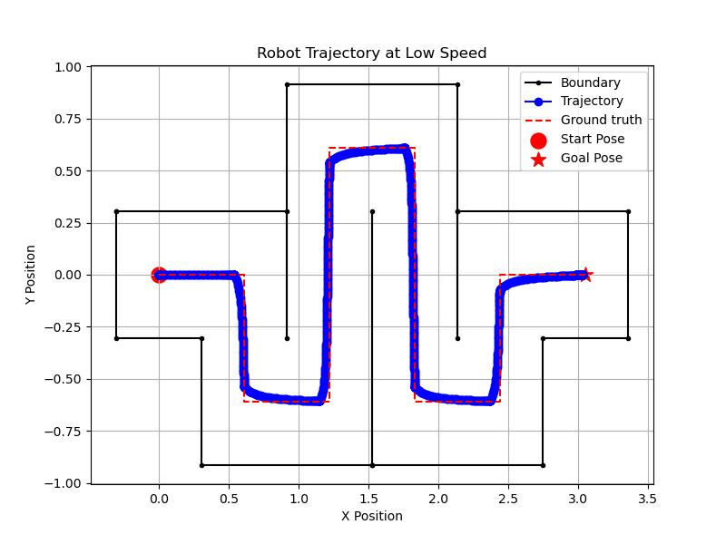
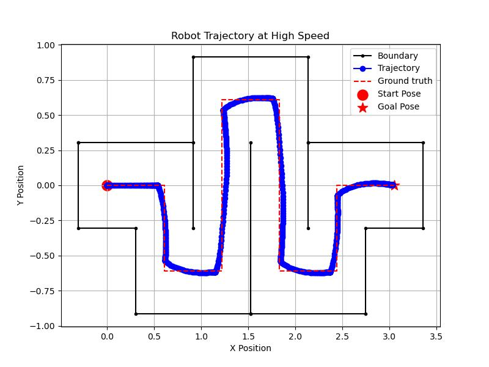
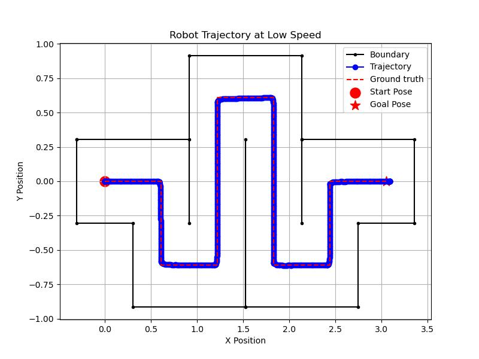
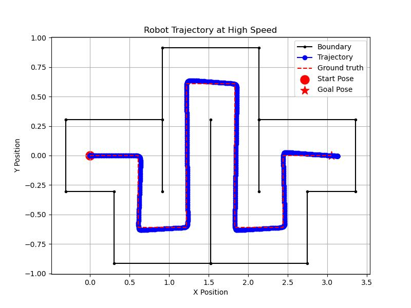
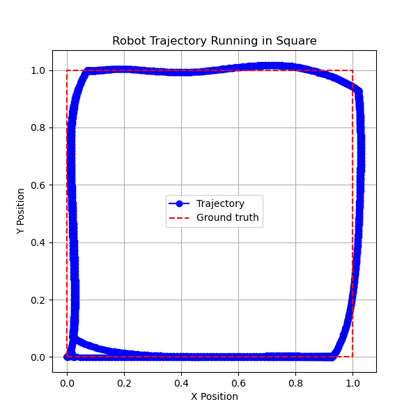
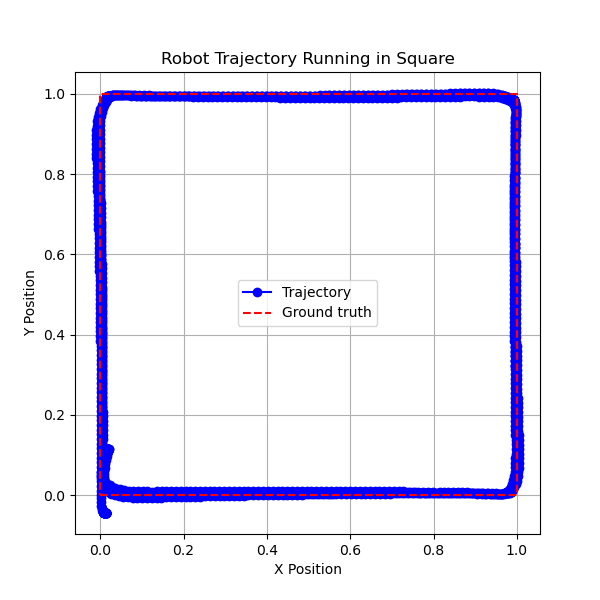
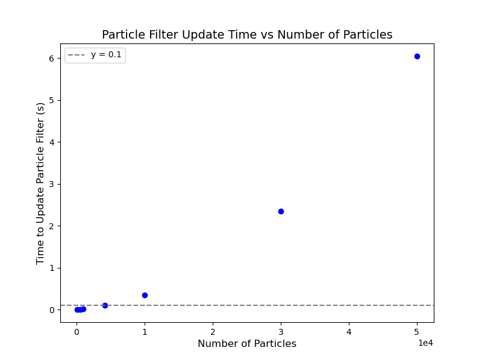
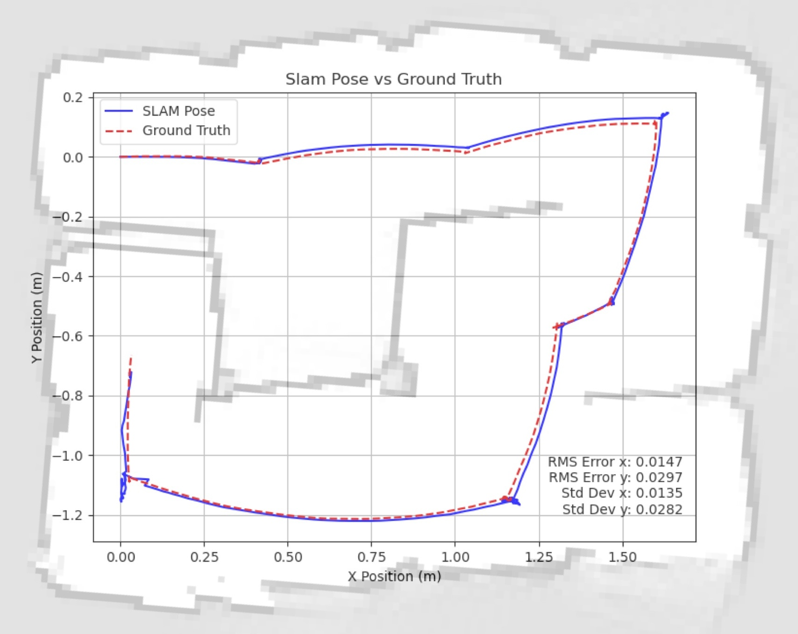
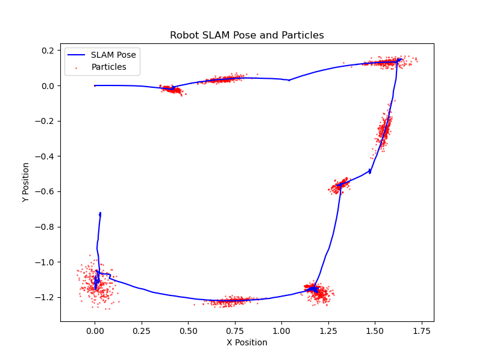

# ROB 550 Botlab-w25 @ UMich
## Overview
Not yet ready...

**Table of content**
- [Results](#results)
- [Code structure](#code-structure)
- [How to start](#how-to-start)
- [Reference](#reference)

## Results
### PID controll for navigation through maze with waypoints
- **Smart Motion Controller**  
  

    
    
  

- **Pure Pursuit Motion Controller**  
  

    
    
  

### PID controll for navigation in square with waypoints

  <figure style="width: 45%; text-align: center;">
    
    <figcaption>Smart Motion Controller</figcaption>
  </figure>
  <figure style="width: 45%; text-align: center;">
    
    <figcaption>Pure Pursuit Motion Controller</figcaption>
  </figure>

### Particle Filter Performances
- **Particle Filter Update Time vs Particle Number**
  

    
  

- **SLAM RMSE and STD**
  

    
  

- **Robot SLAM Pose and Particles**
  

    
  

## Code structure

### Relevant
- [mbot_autonomy](mbot_autonomy)
- [mbot_bridge](mbot_bridge)
- [mbot_firmware](mbot_firmware)
- [mbot_gui](mbot_gui)
- [mbot_lcm_base](mbot_lcm_base)
- [mbot_web_app-v2.0.0](mbot_web_app-v2.0.0)
- [rplidar_lcm_driver](rplidar_lcm_driver)
- [mbot_plot](mbot_plot)
- [mbot_vision](mbot_vision)

### Irrelevant
No need to touch these files.
- [media](media) - where I store media that used for README instructions

## How to start?
Not yet ready...

## Reference
ROB 550 Web Page : https://rob550-docs.github.io/docs/botlab/getting-started.html
